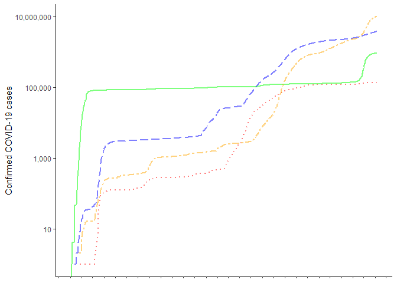
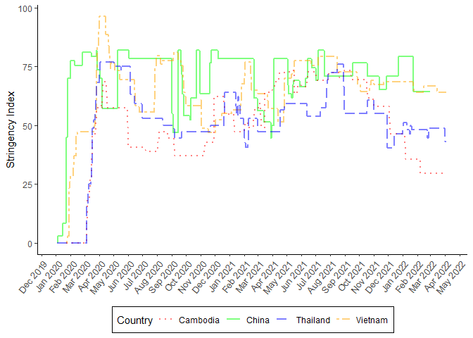
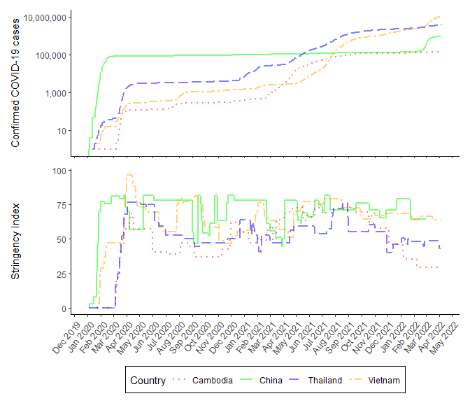

Making the simple plot
================
Erik Delaquis
4/7/2022

First, we load the required packages:

``` r
library(COVID19) #Package that does most of the work
library(tidyverse) #Data reading and manipulation
library(patchwork) #To stitch the two panels together
```

It is possible to set a date range for our graph. By declining to set a
range, the package will default to fetch up-to-date data from the source
databases. This means that each time you run the script it will give you
the most recently reported data. I am running the script on a subset of
countries that I want to compare, at national level (=1).

``` r
##### Get raw data up to the minute from COVID19 package ####
rawdata <- covid19(c("Cambodia","Vietnam","Thailand","China"), level = 1)
```

    ## We have invested a lot of time and effort in creating COVID-19 Data Hub, please cite the following when using it:
    ## 
    ##   Guidotti, E., Ardia, D., (2020), "COVID-19 Data Hub", Journal of Open
    ##   Source Software 5(51):2376, doi: 10.21105/joss.02376.
    ## 
    ## A BibTeX entry for LaTeX users is
    ## 
    ##   @Article{,
    ##     title = {COVID-19 Data Hub},
    ##     year = {2020},
    ##     doi = {10.21105/joss.02376},
    ##     author = {Emanuele Guidotti and David Ardia},
    ##     journal = {Journal of Open Source Software},
    ##     volume = {5},
    ##     number = {51},
    ##     pages = {2376},
    ##   }
    ## 
    ## To retrieve citation and metadata of the data sources see ?covid19cite. To hide this message use 'verbose = FALSE'.

Now we’ll run the script to generate the top panel. This will contain
the cumulative case numbers. I’ll remove the x axis labels because that
is already included in the bottom panel. Other packages can autoalign
axes and force common labels, but for this simple exercise with
consistent axes that is not necessary.

``` r
##### Line plot of cases for top panel #####
require(scales) #For scaling axes

cases <- (case.conf <- ggplot(rawdata, aes(x = date, y = confirmed, group=administrative_area_level_1, color=administrative_area_level_1))) + geom_line(aes(linetype=administrative_area_level_1), size=1, alpha=0.5) + 
  labs(x = NULL, y = "Confirmed COVID-19 cases") + 
  theme_classic() +
  scale_x_date(date_breaks = "1 month", date_labels = "%b %Y")+
  scale_y_continuous(trans='log10', labels=comma) +
  scale_linetype_manual(values=c("dotted","solid","longdash","twodash"))+
  scale_color_manual(name="Country",
                     values=c("red","green","blue","orange")) +
  theme(axis.text.x=element_blank()) +
  theme(legend.position = "none")

cases
```

<!-- -->

Panel 2 will contain the stringency index for measuring COVID policy
application. I parameterize them the same way to match colours and dot
types.

``` r
##### Identical plot for stringency score #####

policy<-(policy.blank <- ggplot(rawdata, aes(x = date, y = stringency_index, group=id)))+geom_line(aes(linetype=administrative_area_level_1, color=administrative_area_level_1), size=1, alpha=0.5) + 
  labs(x = NULL, y = "Stringency Index") +
  scale_x_date(date_breaks = "1 month", date_labels = "%b %Y")+
  theme_classic() + 
  scale_linetype_manual(name="Country",
                        values=c("dotted","solid","longdash","twodash")) +
  scale_color_manual(name="Country",
                     values=c("red","green","blue","orange")) +
  labs(color  = "Country", linetype = "Country") + 
  theme(legend.position = "bottom", legend.background = element_rect(size=0.5, linetype="solid",colour ="black")) + 
  theme(axis.text.x = element_text(angle = 50, vjust = 1, hjust = 1, size = 10))

policy
```

<!-- -->

Putting the plots together using patchwork is dead easy (a big advantage
with complex layouts…)

``` r
##### Multi-plotting with simple patchwork grammar #####
cases / policy
```

<!-- -->

Finally, we want to know what sources were used for our graphs to make
them replicable and publication ready. Luckily for us, the COVID19
package has a function that will parse the data we downloaded and use it
to generate citations.

``` r
##### Generate citations, customized based on the contents of the data selected ########
s <- covid19cite(rawdata)
```

    ## 
    ##   CIA - Central Intelligence Agency (2020),
    ##   https://www.cia.gov/library/publications/the-world-factbook/geos/vm.html
    ## 
    ##   Department of Disease Control of Thailand (2020),
    ##   https://covid19.ddc.moph.go.th/
    ## 
    ##   World Bank Open Data (2018),
    ##   https://data.worldbank.org/indicator/SP.POP.TOTL
    ## 
    ##   Hale Thomas, Sam Webster, Anna Petherick, Toby Phillips, and Beatriz
    ##   Kira (2020). Oxford COVID-19 Government Response Tracker, Blavatnik
    ##   School of Government.
    ## 
    ##   Johns Hopkins Center for Systems Science and Engineering (2020),
    ##   https://github.com/CSSEGISandData/COVID-19
    ## 
    ##   Our World in Data (2020), https://github.com/owid/covid-19-data
    ## 
    ##   World Health Organization (2020), https://covid19.who.int
    ## 
    ## To see these entries in BibTeX format, use 'print(<citation>,
    ## bibtex=TRUE)', 'toBibtex(.)', or set
    ## 'options(citation.bibtex.max=999)'.
